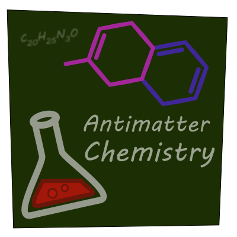

# Antimatter-Chemistry

 

*The hopes of returning back to your home* • [CurseForge](https://www.curseforge.com/minecraft/modpacks/antimatter-chemistry) • [Changelog](config/mputils/changelog.txt) • [Bugtracker](https://github.com/Dark-Arcana/antimatter-chemistry/issues)

&nbsp;

## Introduction

Antimatter Chemistry is a questing/progression pack inspired by [Anti-Material Energy (1.7.10)](https://minecraft.curseforge.com/projects/anti-material-energy?gameCategorySlug=modpacks&projectID=229831) by [Parcel31u](https://www.curseforge.com/members/parcel31u). You find yourself stranded in the Antimatter dimension with nothing but some basic gear, [a chemistry set](https://www.curseforge.com/minecraft/mc-mods/alchemistry), and the hopes of returning back to your home.

Coming in at about 100 mods, this pack loads quick and performs well on potato computers, but still remains a unique hand-crafted and engaging experience that can provide dozens of hours of fun.
Please submit issues and suggestions to this repo for my modpack [Antimatter Chemistry](https://minecraft.curseforge.com/projects/antimatter-chemistry).
Come hang out on [Official Discord](https://discord.gg/QVbzp5J) to chat about the pack.
